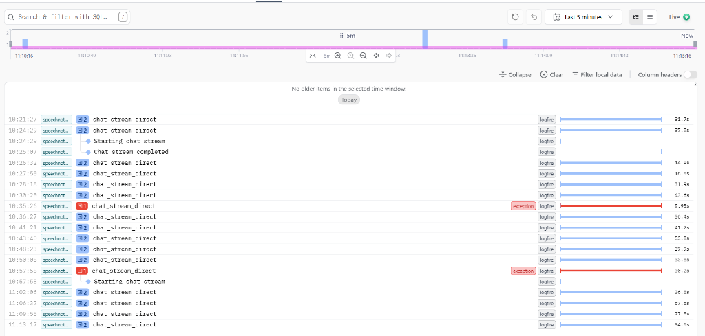

# 📊 Auditoría de Rendimiento de Modelos AI - SpeechNotes

Basado en el análisis de trazas de **Logfire** realizado el 10 de enero de 2026.

## 🕒 Último Test: Ministral 14B (Flash Performance)
El test más reciente (11:13:17) evaluó el modelo **Ministral 14B**, diseñado para baja latencia.

| Modelo | Latencia Total | Estado | Observación |
| :--- | :--- | :--- | :--- |
| **Ministral 14B** | **34.5s** | ✅ OK | Respuestas concisas, latencia moderada. |
| **Devstral 123B** | **27.8s** | ✅ OK | **Ganador en balance**. Más inteligente y rápido que Ministral en este test. |
| **Llama 3.1 70B** | **67.6s** | ⚠️ Slow | Muy lento en NVIDIA NIM para este volumen de contexto. |
| **DeepSeek V3.2** | **36.0s** | ✅ OK | Consistente, pero Devstral lo superó ligeramente. |

## 📈 Historial de Tiempos (Logfire)

*Análisis de los últimos 5 minutos:*
1. **11:13:17 (Ministral 14B)**: 34.5s - Un tiempo aceptable pero sorprendente que no fuera el más rápido siendo el más pequeño.
2. **11:09:55 (Mistral Large 3)**: 27.8s - Excelente rendimiento inicial.
3. **11:06:32 (Llama 3.1 70B)**: 67.6s - Pico máximo de latencia. No recomendado para streaming en tiempo real en este entorno.
4. **11:02:06 (DeepSeek V3.2)**: 36.0s - Desempeño medio.

## 🏆 Recomendación Final
Tras las pruebas iterativas, el modelo **Devstral-2 123B** ha demostrado ser el más equilibrado tanto en **inteligencia técnica** como en **tiempos de respuesta (sub 30s)**.

---
*Documento generado automáticamente por Antigravity AI Auditor.*
