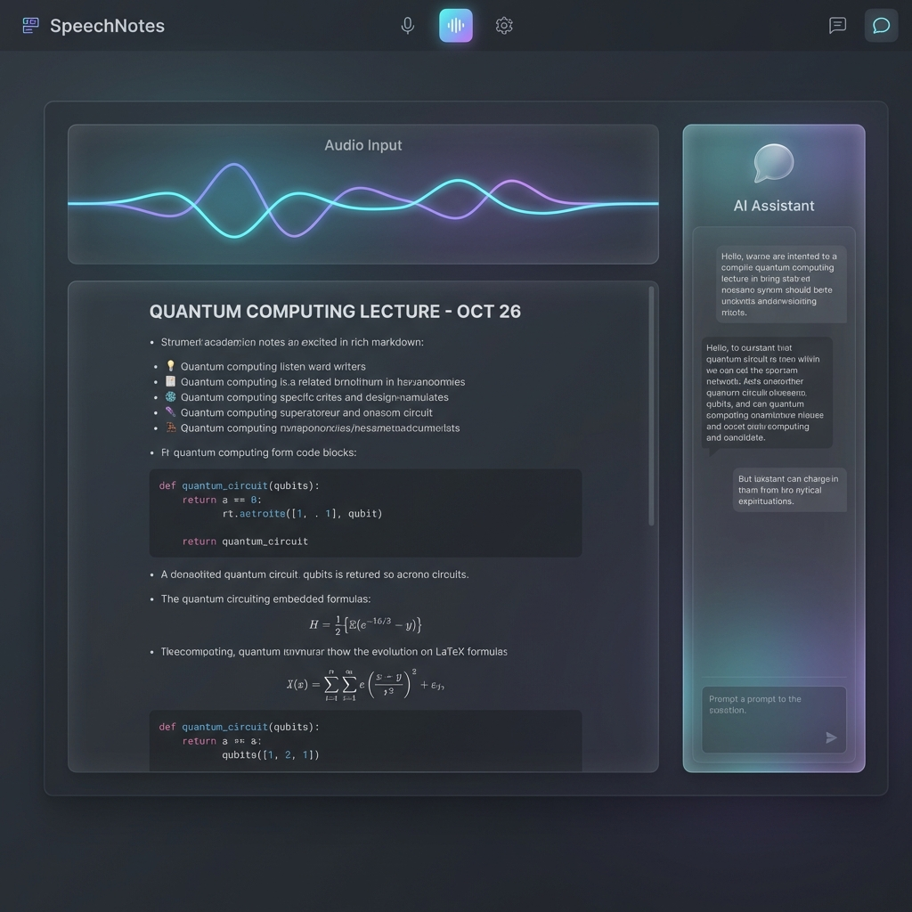

<div align="center">

# SpeechNotes

**Transcripción inteligente asistida por IA — graba, limpia, transcribe y formatea en tiempo real**

[](https://python.org)
[](https://fastapi.tiangolo.com)
[](https://nextjs.org)
[](https://build.nvidia.com)
[](LICENSE)



</div>

---

## ¿Qué hace SpeechNotes?

Convierte audio en notas estructuradas usando un pipeline de cinco modelos NVIDIA NIM especializados:

| Paso | Modelo | Qué hace |
|------|--------|----------|
| 1. Limpieza de ruido | NVIDIA BNR (gRPC) | Elimina ruido de fondo antes de transcribir |
| 2. Transcripción | `nvidia/parakeet-tdt-0.6b-v2` | Convierte voz a texto con alta precisión |
| 3. Detección de idioma | `google/gemma-3n-e4b-it` | Identifica automáticamente el idioma |
| 4. Traducción | `mistralai/mistral-large-3-675b-instruct-2512` | Traduce a cualquier idioma |
| 5. Formateo | `qwen/qwen3.5-397b-a17b` | Reestructura las notas con YAML, secciones y resumen |

---

## Funciones principales

- **Grabación con detección de voz (VAD)** — graba solo cuando hay voz; calibración de umbrales en vivo
- **Pipeline de audio modular** — elige entre `full`, `asr_only`, `denoise` o `passthrough`
- **Formateo IA con WebSocket** — progreso en tiempo real mientras el agente reformatea tus notas
- **Búsqueda semántica RAG** — encuentra conceptos en todas tus transcripciones via ChromaDB
- **Chat contextual** — pregunta al agente sobre el contenido de tus notas con `qwen3.5`
- **Procesamiento FFmpeg** — normaliza, acelera, quita silencios, convierte formato
- **Aplicación Electron** — versión desktop para Windows/macOS con icono en bandeja
- **Autenticación flexible** — modo desarrollo sin clave, producción con JWT/OAuth

---

## Stack

| Capa | Tecnología |
|------|-----------|
| Frontend | Next.js 16, HeroUI, Socket.IO Client, Electron |
| Backend | FastAPI, Socket.IO, pydub, FFmpeg, Logfire |
| Modelos IA | NVIDIA NIM (Parakeet, BNR, Gemma, Mistral, Qwen 3.5) |
| Base de datos | MongoDB, ChromaDB |
| Infraestructura | Docker, Python 3.12, pnpm |

---

## Inicio rápido

### Requisitos
- Python 3.12+, Node.js 20+, pnpm, MongoDB, API keys NVIDIA NIM

### Instalar y ejecutar

```bash
# 1. Clonar y configurar
git clone https://github.com/gamurigm/SpeechNotes.git && cd SpeechNotes
cp .env.example .env   # Añadir NVIDIA API keys (ver sección abajo)

# 2. Dependencias
pip install -r backend/requirements.txt
cd web && pnpm install && cd ..

# 3. Ejecutar (Windows)
.\run_all.ps1

# O manualmente:
# Terminal 1 → python backend/main.py        (puerto 9443)
# Terminal 2 → cd web && pnpm dev            (puerto 3006)
```

**Docker:**
```bash
docker-compose up --build
```

**Electron (desktop):**
```bash
cd desktop && npm run electron:dev
```

---

## API Keys necesarias

```dotenv
# .env
NVIDIA_API_KEY_ASR=nvapi-...          # Transcripción (Parakeet)
NVIDIA_API_KEY_BNR=nvapi-...          # Ruido (opcional — passthrough si falta)
NVIDIA_API_KEY_DETECTOR=nvapi-...     # Detección de idioma (Gemma)
NVIDIA_API_KEY_TRANSLATOR=nvapi-...   # Traducción (Mistral Large)
NVIDIA_API_KEY_THINKING=nvapi-...     # Chat y formateo (Qwen 3.5)

CHAT_MODEL_THINKING=qwen/qwen3.5-397b-a17b
ASR_MODEL=nvidia/parakeet-tdt-0.6b-v2
DETECTOR_MODEL=google/gemma-3n-e4b-it
TRANSLATOR_MODEL=mistralai/mistral-large-3-675b-instruct-2512

MONGO_URI=mongodb://localhost:27017/
```

---

## Endpoints principales

```
POST /api/audio/transcribe          Transcribir archivo de audio
POST /api/audio/denoise             Eliminar ruido (devuelve WAV)
POST /api/audio/pipeline            Pipeline completo BNR → ASR → traducción

POST /api/translate                 Traducir texto (Mistral Large)
POST /api/translate/detect          Detectar idioma (Gemma 3n)
POST /api/translate/batch           Traducción batch en paralelo

GET  /api/format/files              Listar transcripciones disponibles
POST /api/format/start              Iniciar job de formateo con IA
WS   /api/format/ws/{job_id}        Progreso en tiempo real

GET  /api/transcriptions            Listar transcripciones
GET  /api/chat                      Chat con el agente (streaming)
```

---

## Documentación

- [Patrones de diseño aplicados](./docs/patrones_diseno.md)
- [Servicios NIM — arquitectura y referencia](./docs/internal/nim_services.md)
- [Guía Docker](./docs/DOCKER.md)

---

## Licencia

MIT — desarrollado como proyecto académico en ESPE.
