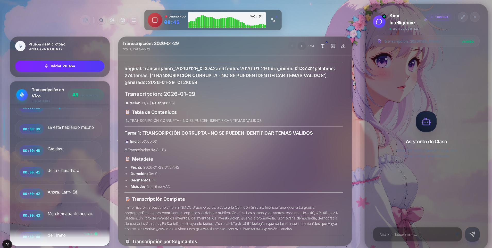

# 🎙️ SpeechNotes: Tu Superpoder para Clases y Reuniones 🚀

¡Bienvenido a la revolución de la productividad! **SpeechNotes** no es solo una app de grabación; es tu asistente personal de inteligencia artificial que escucha, entiende y organiza todo lo que se dice por ti. 

---

## 🌟 ¿Qué puedes hacer con SpeechNotes?

Diseñado para estudiantes y profesionales que quieren enfocarse en el contenido, no en las notas. 🎯

### 🔊 1. Captura Inteligente (NVIDIA Riva)
*   **Transcripción ASR en Vivo:** Precisión de grado profesional con **NVIDIA Riva**. Capturamos cada detalle con latencia mínima.
*   **Silencio Inteligente (VAD):** Detección automática de voz para ignorar ruidos de fondo y optimizar el almacenamiento.
*   **Control Maestro de Audio:** Ajuste de sensibilidad inteligente y ganancia digital para capturas nítidas en cualquier entorno.

### 📝 2. El Editor de Notas del Futuro
*   **Markdown Enriquecido:** Tus clases se guardan automáticamente con títulos, listas y formato profesional.
*   **Vista Previa Instantánea:** Edita y refina tus notas mientras visualizas el resultado final de forma elegante.
*   **Historial Visual:** Navega entre tus "Clases Pasadas" con un sistema de tarjetas dinámico. ¡Nunca pierdas un tema!

### 🧠 3. Cerebro Multimodelo (Kimi, Minimax & Llama)
*   **Kimi Intelligence (Kimi K2):** Tu asistente principal para análisis profundo de documentos y chat contextual inteligente.
*   **Minimax M2:** Especialista en dar formato profesional, estructurar resúmenes y organizar tus notas académicas.
*   **Búsqueda Semántica (Llama 3.2):** Usamos embeddings de **Llama 3.2 Nemoretriever** para encontrar conceptos exactos en milisegundos, no solo palabras.

### 💬 Modos de Chat
1.  **Modo Fast (Rápido):** Más especulativo y fluido. Presta mayor detalle a las entonaciones e inferencias del contexto para respuestas ágiles.
2.  **Análisis Profundo (Thinking):** Más formal y preciso. Evita la especulación para ofrecer detalles rigurosos y razonamientos exactos sobre tus notas.
3.  **Experiencia Inmersiva:** Usa el botón **"Expandir"** para un enfoque total en la conversación.

---

## 🔐 Lo que necesitas para brillar
Para que el motor de IA funcione al 100%, asegúrate de tener tus llaves en el archivo `.env`:
*   `NVIDIA_API_KEY`: El combustible para la transcripción. ⛽
*   `MONGO_URI`: Tu bodega segura de conocimientos. 📦

---

**SpeechNotes** 
