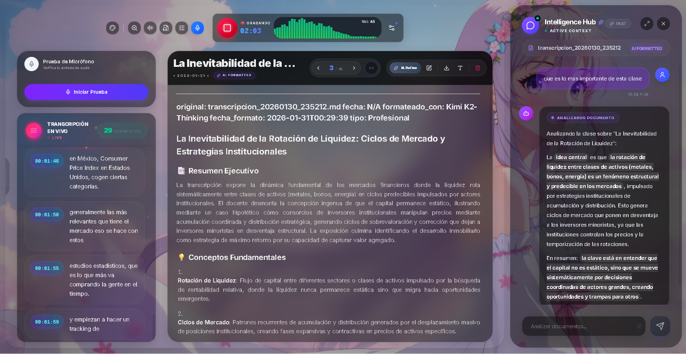

# SpeechNotes — Transcripción Inteligente con IA



> Sistema de transcripción, formateo y traducción asistido por múltiples modelos NVIDIA NIM.  
> Graba, transcribe, limpia ruido, detecta idioma y formatea tus clases o reuniones en tiempo real.

---

## Funcionalidades Principales

### Para Estudiantes y Profesionales
- **Grabación en vivo con VAD** — solo graba cuando hay voz; ajuste dinámico de umbrales
- **Transcripción ASR** con `nvidia/parakeet-tdt-0.6b-v2` — precisión optimizada para habla continua
- **Eliminación de ruido BNR** — pipeline gRPC contra `grpc.nvcf.nvidia.com` (modo passthrough si no está configurado)
- **Detección de idioma** con `google/gemma-3n-e4b-it` — identifica el idioma del audio transcrito
- **Traducción** con `mistralai/mistral-large-3-675b-instruct-2512` — dominios academic / technical / general
- **Formateo con IA** — `qwen/qwen3.5-397b-a17b` reestructura tus notas crudas en documentos con YAML frontmatter
- **Búsqueda semántica RAG** — encuentra conceptos en todas tus transcripciones via ChromaDB + Llama NemoRetriever
- **Chat contextual** — pregunta al agente sobre el contenido de tus notas

### Procesamiento de Audio
- Normalización FFmpeg, limpieza de silencios, conversión de formato
- Perfiles predefinidos: transcripción 16kHz mono, FLAC alta calidad, MP3 almacenamiento
- Visualización de niveles y calibración de micrófono en vivo

---

## Stack Tecnológico

### Frontend
- **Next.js 16** — App Router, Turbopack
- **HeroUI 2** — componentes con glassmorphism
- **Electron** — aplicación desktop empaquetada
- **Socket.IO Client** — transcripción en tiempo real

### Backend
- **FastAPI + Socket.IO** — API REST asíncrona con WebSockets
- **pydub + FFmpeg** — procesamiento de audio
- **Logfire** — observabilidad y trazas

### Modelos NVIDIA NIM

| Rol | Modelo | Protocolo |
|-----|--------|-----------|
| Transcripción ASR | `nvidia/parakeet-tdt-0.6b-v2` | HTTP `/audio/transcriptions` |
| Eliminación de ruido | NVIDIA BNR | gRPC TLS |
| Detección de idioma | `google/gemma-3n-e4b-it` | HTTP chat completions |
| Traducción | `mistralai/mistral-large-3-675b-instruct-2512` | HTTP chat completions |
| Formateo / Chat | `qwen/qwen3.5-397b-a17b` | HTTP chat completions |
| Embeddings | `nvidia/llama-3.2-nemoretriever-300m-embed-v2` | HTTP embeddings |

### Infraestructura
- **MongoDB** — almacenamiento de transcripciones
- **ChromaDB** — base de datos vectorial para RAG
- **Docker** — contenedorización completa

---

## Inicio Rápido

### Requisitos
- Python 3.12+
- Node.js 20+ y pnpm
- MongoDB (local o Atlas)
- API keys NVIDIA NIM (ver `.env.example`)

### Configuración

```bash
# 1. Clonar
git clone <repo>
cd SpeechNotes

# 2. Variables de entorno
cp .env.example .env
# Editar .env con tus claves (ver sección API Keys abajo)

# 3. Dependencias backend
pip install -r backend/requirements.txt

# 4. Dependencias frontend
cd web && pnpm install && cd ..
```

### Ejecutar

**Windows (automático):**
```powershell
.\run_all.ps1
```

**Manual:**
```bash
# Terminal 1 — Backend
$env:PYTHONPATH="backend;."
python backend/main.py
# → http://127.0.0.1:9443

# Terminal 2 — Frontend
cd web && pnpm dev
# → http://localhost:3006
```

**Docker:**
```bash
docker-compose up --build
```

**Electron (desktop):**
```bash
cd desktop && npm run electron:dev
```

---

## API Keys Necesarias

Añadir al archivo `.env`:

```dotenv
# Transcripción ASR
NVIDIA_API_KEY_ASR=nvapi-...
ASR_MODEL=nvidia/parakeet-tdt-0.6b-v2

# Eliminación de ruido (opcional — passthrough si no está)
NVIDIA_API_KEY_BNR=nvapi-...
BNR_GRPC_HOST=grpc.nvcf.nvidia.com
BNR_GRPC_PORT=443
BNR_FUNCTION_ID=0f21a9ce-2e90-4f93-97bc-7fc6edd02222

# Detección de idioma
NVIDIA_API_KEY_DETECTOR=nvapi-...
DETECTOR_MODEL=google/gemma-3n-e4b-it

# Traducción
NVIDIA_API_KEY_TRANSLATOR=nvapi-...
TRANSLATOR_MODEL=mistralai/mistral-large-3-675b-instruct-2512

# Chat / Formateo (Qwen 3.5)
NVIDIA_API_KEY_THINKING=nvapi-...
CHAT_MODEL_THINKING=qwen/qwen3.5-397b-a17b

# MongoDB
MONGO_URI=mongodb://localhost:27017/
MONGO_DB_NAME=agent_knowledge_base
```

---

## Endpoints de la API

### Audio NIM
| Método | Ruta | Descripción |
|--------|------|-------------|
| `POST` | `/api/audio/transcribe` | Transcripción con Parakeet (subir archivo) |
| `POST` | `/api/audio/denoise` | Eliminación de ruido BNR (retorna WAV) |
| `POST` | `/api/audio/pipeline` | Pipeline completo: BNR → ASR → traducción |

### Traducción NIM
| Método | Ruta | Descripción |
|--------|------|-------------|
| `POST` | `/api/translate` | Traducir texto con Mistral Large |
| `POST` | `/api/translate/detect` | Detectar idioma con Gemma 3n |
| `POST` | `/api/translate/batch` | Traducción batch en paralelo |

### Transcripciones
| Método | Ruta | Descripción |
|--------|------|-------------|
| `GET` | `/api/transcriptions` | Listar transcripciones paginadas |
| `GET` | `/api/transcriptions/{id}` | Obtener transcripción por ID |
| `DELETE` | `/api/transcriptions/{id}` | Eliminar transcripción |

### Formateo con IA
| Método | Ruta | Descripción |
|--------|------|-------------|
| `GET` | `/api/format/files` | Listar archivos disponibles |
| `POST` | `/api/format/start` | Iniciar job de formateo |
| `WS` | `/api/format/ws/{job_id}` | Progreso en tiempo real |
| `GET` | `/api/format/job/{job_id}` | Estado del job |

---

## Estructura del Proyecto

```
backend/
  routers/          ← endpoints HTTP y WebSocket
  services/
    audio/          ← ASR, BNR, pipeline, VAD, transcription_service
    agents/         ← pydantic_agent (chat), formatter_agent
    knowledge/      ← RAG, content_renderer
    realtime/       ← socket_handler (Socket.IO)
    nim/            ← adapters HTTP/gRPC y registry de clientes
    translation/    ← detector (Gemma), translator (Mistral)
  repositories/     ← acceso a MongoDB
  utils/            ← auth, helpers

web/                ← Next.js 16 frontend
  app/dashboard/    ← interfaz principal
  public/chat-icons/← iconos de la UI

desktop/            ← empaquetado Electron
assets/
  icons/            ← imágenes de la UI
  audio/            ← muestras de audio
scripts/
  demos/            ← scripts de demostración RAG/agente
docs/internal/      ← documentación técnica
```

---

## Pipelines de Audio

| Pipeline | Pasos | Caso de uso |
|----------|-------|-------------|
| `full` | BNR → ASR → Traducción | Audio con ruido, transcripción multiidioma |
| `asr_only` | ASR | Audio limpio, sin traducción |
| `denoise` | BNR | Solo limpieza de ruido, sin transcribir |
| `passthrough` | — | Diagnóstico / pruebas |

---

## Pruebas

```bash
# Ejecutar suite completa
$env:PYTHONPATH="backend"
python -m pytest backend/tests/ -v

# Tests específicos
python -m pytest backend/tests/test_settings.py backend/tests/test_security.py
```

---

## Docker

```bash
# Construir e iniciar
docker-compose up --build

# Detener
docker-compose down

# Logs
docker-compose logs -f backend
```

Servicios:
- `backend` → FastAPI + Socket.IO en puerto **9443**
- `frontend` → Next.js en puerto **3006**
- `mongodb` → puerto 27017

---

## Documentación Adicional

- [Patrones de Diseño GoF aplicados](./docs/patrones_diseno.md)
- [Guía Docker detallada](./docs/DOCKER.md)
- [Servicios NIM — arquitectura y referencia de API](./docs/internal/nim_services.md)

---

## Licencia

MIT

