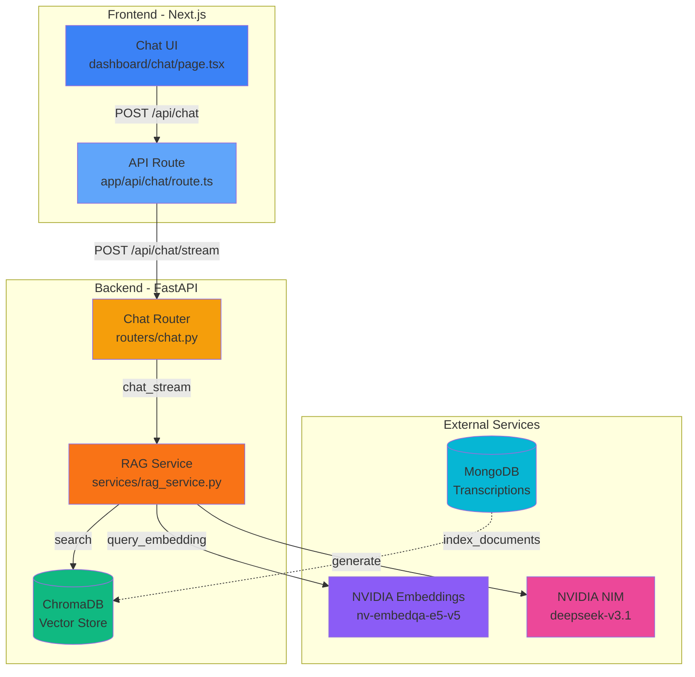
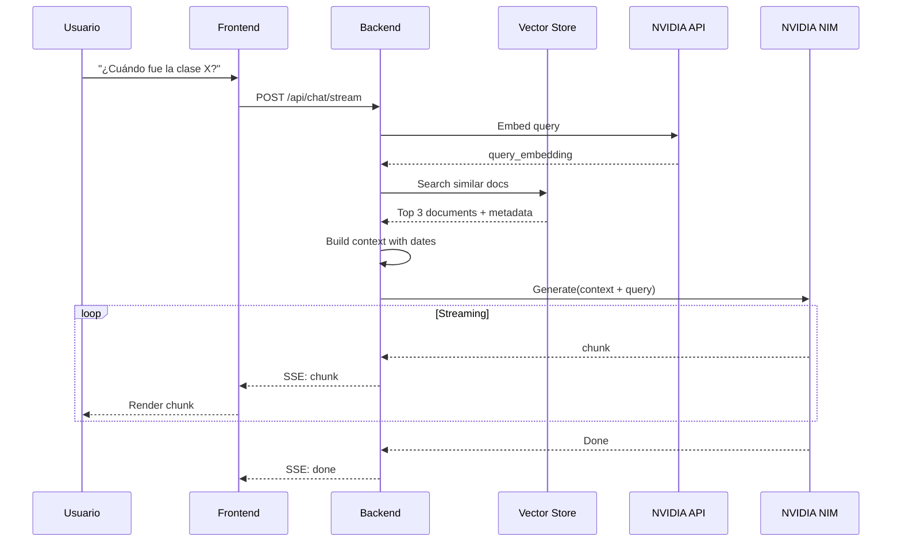
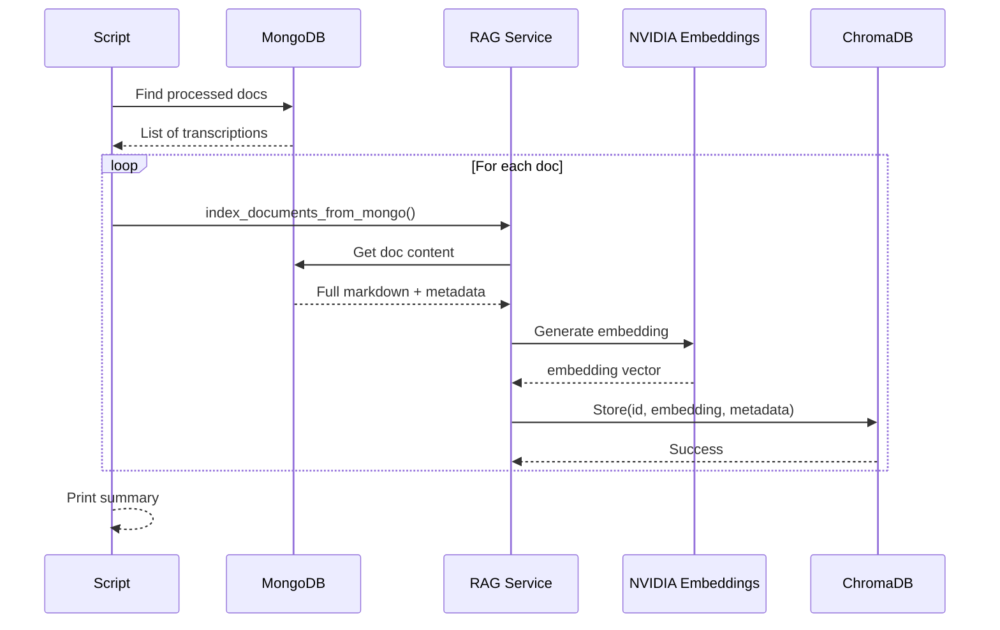

# Arquitectura del Sistema de Chat Semántico

## Diagrama de Componentes



## Flujo de Datos: Pregunta del Usuario



## Flujo de Indexación



## Estructura de Datos

### Documento en MongoDB

```json
{
  "_id": ObjectId("..."),
  "filename": "transcripcion_20251207_143022.md",
  "processed": true,
  "created_at": "2025-12-07T14:30:22",
  "duration": 1234.5,
  "markdown_content": "# Clase de Análisis...",
  "ingested_at": "2025-12-07T14:35:00"
}
```

### Embedding en ChromaDB

```json
{
  "id": "675a1b2c3d4e5f6g7h8i9j0",
  "embedding": [0.123, -0.456, 0.789, ...],  // 1024 dimensions
  "metadata": {
    "filename": "transcripcion_20251207_143022.md",
    "created_at": "2025-12-07T14:30:22",
    "duration": 1234.5,
    "source": "mongodb",
    "fecha_formateada": "07 de Diciembre de 2025, 14:30:22"
  },
  "document": "# Clase de Análisis...\n\n..."  // Full content
}
```

### Mensaje de Chat (Frontend)

```typescript
{
  id: "msg_123",
  role: "user" | "assistant",
  parts: [
    { type: "text", text: "¿Cuándo fue la clase X?" }
  ]
}
```

### Request al Backend

```json
{
  "messages": [
    { "role": "user", "content": "¿Cuándo fue la clase X?" }
  ]
}
```

### Response (SSE Stream)

```
data: {"content": "La", "done": false}

data: {"content": " clase", "done": false}

data: {"content": " fue el", "done": false}

data: {"content": " 7 de diciembre", "done": false}

data: {"done": true}

```

## Componentes Clave

### RAG Service Pipeline

```python
def chat_stream(query):
    # 1. Retrieve
    query_emb = get_embedding(query, type="query")
    results = vector_store.search(query_emb, k=3)
    
    # 2. Augment
    context = build_context(results)  # Include dates!
    
    # 3. Generate
    prompt = f"Context: {context}\nQ: {query}\nA:"
    for chunk in llm.stream_generate(prompt):
        yield chunk
```

### Context Building

```python
def _prepare_context_and_sources(query, k=3):
    results = vector_store.query_similar(query_embedding, n_results=k)
    
    context_parts = []
    for doc, meta in results:
        # Format with emojis for better UX
        info = f"""
📄 Documento: {meta['filename']}
📅 Fecha: {format_date(meta['created_at'])}
⏱️ Duración: {meta['duration']}s

Contenido:
{doc}
"""
        context_parts.append(info)
    
    return "\n\n---\n\n".join(context_parts)
```

## Tecnologías Utilizadas

| Componente | Tecnología | Propósito |
|------------|-----------|-----------|
| Frontend UI | Next.js 16 + React 19 | Interfaz moderna |
| Chat Hook | Vercel AI SDK | Manejo de streaming |
| Backend API | FastAPI | REST + SSE |
| Vector DB | ChromaDB | Almacén de embeddings |
| Embeddings | NVIDIA nv-embedqa-e5-v5 | Vectorización semántica |
| LLM | NVIDIA DeepSeek-V3.1 | Generación de texto |
| Document Store | MongoDB | Persistencia de docs |

## Métricas de Performance

| Operación | Tiempo Promedio |
|-----------|-----------------|
| Embedding query | ~200ms |
| Vector search (k=3) | ~50ms |
| LLM first token | ~500ms |
| LLM full response | ~2-5s |
| **Total (perceived)** | **~1s** (streaming) |

## Escalabilidad

### Límites Actuales
- **Documentos**: ~1000 docs (ChromaDB local)
- **Consultas simultáneas**: ~10 usuarios
- **Tamaño de contexto**: 3 documentos × ~2KB = ~6KB

### Para Escalar
- [ ] ChromaDB → Pinecone/Weaviate (cloud)
- [ ] FastAPI → Multiple workers (Gunicorn)
- [ ] Redis cache para embeddings frecuentes
- [ ] CDN para frontend
