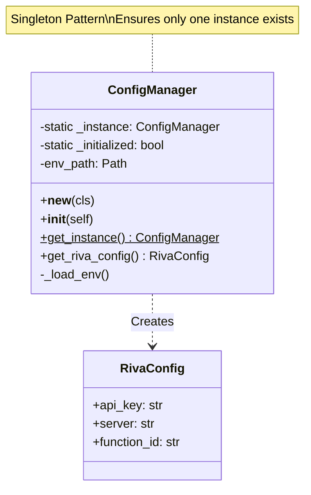

# Documentación Técnica: ConfigManager y Patrón Singleton

Este documento proporciona una explicación detallada sobre la clase `ConfigManager`, su implementación del patrón de diseño **Singleton**, y las pruebas unitarias asociadas. Está diseñado para ser una referencia técnica para el equipo de ingeniería.

---

## 1. Visión General: ConfigManager

`ConfigManager` es el componente central responsable de la gestión de la configuración en la aplicación. Su propósito principal es cargar, validar y proveer acceso a las variables de entorno (como claves de API y direcciones de servidores) de manera consistente en todo el sistema.

### Responsabilidades
*   **Carga de Configuración**: Lee variables desde el archivo `.env`.
*   **Validación**: Asegura que las variables críticas (como `API_KEY`) existan.
*   **Acceso Centralizado**: Provee métodos tipados (como `get_riva_config()`) para acceder a los valores.
*   **Unicidad**: Garantiza que solo exista una copia de la configuración en memoria.

---

## 2. Implementación del Patrón Singleton

El patrón **Singleton** se utiliza para asegurar que `ConfigManager` tenga una única instancia durante el ciclo de vida de la aplicación. Esto es crucial para evitar inconsistencias (ej. dos partes del sistema usando diferentes configuraciones) y ahorrar recursos (no leer el archivo `.env` múltiples veces).

### Detalles de Implementación (`src/core/config.py`)

La implementación en Python utiliza el método mágico `__new__` para controlar la creación de la instancia.

```python
class ConfigManager:
    _instance: Optional['ConfigManager'] = None
    _initialized: bool = False
    
    def __new__(cls, env_path: Optional[Path] = None):
        if cls._instance is None:
            cls._instance = super().__new__(cls)
        return cls._instance
```

#### Puntos Clave:
1.  **Variable de Clase `_instance`**: Almacena la única instancia creada. Inicialmente es `None`.
2.  **Método `__new__`**: Se ejecuta *antes* de `__init__`.
    *   Verifica si `_instance` ya existe.
    *   Si no existe, crea una nueva instancia usando `super().__new__(cls)`.
    *   Si ya existe, devuelve la instancia existente.
3.  **Control de Inicialización (`_initialized`)**:
    *   Como `__init__` se llama cada vez que se invoca `ConfigManager()`, usamos una bandera `_initialized` para evitar re-leer el archivo `.env` o re-configurar el objeto innecesariamente.

```python
    def __init__(self, env_path: Optional[Path] = None):
        if self._initialized:
            return  # Si ya está inicializado, no hacer nada
            
        self.env_path = env_path or self._find_env_file()
        self._load_env()
        self._initialized = True
```

### Método de Acceso Global

Aunque se puede instanciar directamente, se recomienda usar el método estático `get_instance()` para mayor claridad semántica.

```python
    @classmethod
    def get_instance(cls, env_path: Optional[Path] = None) -> 'ConfigManager':
        if cls._instance is None:
            cls._instance = cls(env_path)
        return cls._instance
```

---

## 3. Diagrama de Clases (UML)



---

## 4. Pruebas del Singleton (`test_singleton.py`)

El archivo de pruebas verifica matemáticamente y lógicamente que el patrón se cumpla.

### Estrategia de Prueba
El script realiza tres verificaciones principales:

1.  **Identidad de Instancia**:
    *   Llama a `ConfigManager.get_instance()` dos veces.
    *   Llama al constructor `ConfigManager()` directamente.
    *   **Verificación**: Comprueba que los `id()` (direcciones de memoria) de los tres objetos sean idénticos.
    
    ```python
    if config1 is config2 is config3:
        print("✅ ÉXITO: Las tres variables apuntan a la MISMA instancia")
    ```

2.  **Consistencia de Estado**:
    *   Obtiene la configuración de dos referencias distintas.
    *   **Verificación**: Asegura que los valores internos (ej. `api_key`) sean idénticos.

3.  **Resiliencia**:
    *   Intenta "engañar" a la clase instanciándola de diferentes formas para asegurar que el mecanismo de protección en `__new__` es robusto.

### Resultado Esperado
Al ejecutar el test, la salida confirma la unicidad:

```text
1. Creando primera instancia con get_instance()...
   config1 id: 2663849201234

2. Obteniendo segunda instancia con get_instance()...
   config2 id: 2663849201234

✅ ÉXITO: Las tres variables apuntan a la MISMA instancia
✅ PATRÓN SINGLETON IMPLEMENTADO CORRECTAMENTE
```

---

## 5. Conclusión para Ingeniería

La implementación actual de `ConfigManager` es robusta y cumple estrictamente con el patrón Singleton.
*   **Seguridad**: Previene la carga múltiple de configuraciones.
*   **Eficiencia**: Minimiza operaciones de I/O al leer el disco solo una vez.
*   **Mantenibilidad**: Centraliza la lógica de configuración en un solo punto de verdad.

Esta arquitectura es ideal para gestionar conexiones a servicios externos (como NVIDIA Riva) donde la consistencia de las credenciales es crítica.
