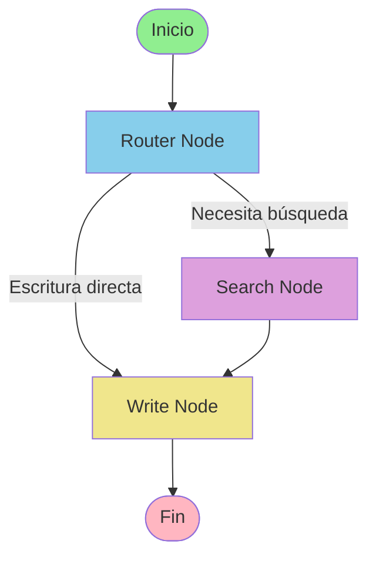

# Visualización del Workflow LangGraph

## 🎯 Diagrama del Flujo


## 📊 Estructura del Grafo

### Nodos

1. **START** (Punto de entrada)
   - Recibe la consulta del usuario
   - Inicializa el estado del agente

2. **ROUTER NODE** (Nodo de decisión)
   - **Función**: Analiza la consulta del usuario
   - **Decisión**: ¿Necesita búsqueda o escritura directa?
   - **Criterios**:
     - Si contiene keywords de búsqueda → `SEARCH`
     - Si no contiene keywords → `WRITE` (directo)

3. **SEARCH NODE** (Búsqueda semántica)
   - **Función**: Busca documentos relevantes
   - **Tecnología**: FAISS + NVIDIA Embeddings
   - **Salida**: Top-K documentos más similares
   - **Siguiente**: Siempre va a `WRITE`

4. **WRITE NODE** (Generación de texto)
   - **Función**: Genera respuesta con NVIDIA NIM
   - **Entrada**: Query + Contexto (opcional)
   - **Modelo**: DeepSeek-V3.1-Terminus
   - **Siguiente**: Siempre termina (`END`)

5. **END** (Punto de salida)
   - Retorna la respuesta generada
   - Finaliza el workflow

---

## 🔀 Flujos Posibles

### Flujo 1: Con Búsqueda Semántica
```
START → ROUTER → SEARCH → WRITE → END
```

**Ejemplo**:
- Query: "¿Qué es FAISS?"
- Router detecta: "¿Qué es" (keyword)
- Search busca documentos sobre FAISS
- Write genera respuesta con contexto
- END retorna respuesta

### Flujo 2: Escritura Directa
```
START → ROUTER → WRITE → END
```

**Ejemplo**:
- Query: "Escribe un haiku sobre programación"
- Router detecta: No hay keywords de búsqueda
- Write genera directamente (sin contexto)
- END retorna respuesta

---

## 🎯 Lógica del Router

### Keywords de Búsqueda

El router detecta estas palabras clave para decidir si buscar:

**Español**:
- `buscar`, `encontrar`
- `qué es`, `cuál es`
- `información sobre`, `dime sobre`
- `explica`, `describe`

**Inglés**:
- `search`, `find`
- `what is`, `which`
- `information about`, `tell me about`
- `explain`, `describe`

### Código del Router

```python
def router_node(state: AgentState) -> AgentState:
    query = state["query"]
    
    search_keywords = [
        "buscar", "search", "encontrar", "find",
        "qué es", "what is", "información sobre",
        "explica", "explain", "describe"
    ]
    
    query_lower = query.lower()
    needs_search = any(keyword in query_lower for keyword in search_keywords)
    
    if needs_search and len(vector_store) > 0:
        state["next_action"] = "search"
    else:
        state["next_action"] = "write"
    
    return state
```

---

## 📝 Ejemplos de Ejecución

### Ejemplo 1: Búsqueda + Generación

**Input**:
```python
query = "Explica qué es Python"
```

**Flujo**:
1. **ROUTER**: Detecta "Explica" → `next_action = "search"`
2. **SEARCH**: Busca documentos sobre Python
   ```
   Resultados:
   [1] Score: 0.945 - "Python es un lenguaje de programación..."
   [2] Score: 0.823 - "Python se usa en ciencia de datos..."
   ```
3. **WRITE**: Genera respuesta usando los documentos como contexto
   ```
   Prompt construido:
   "Basándote en la siguiente información de contexto, responde...
   
   Contexto:
   [Resultado 1] Python es un lenguaje de programación...
   [Resultado 2] Python se usa en ciencia de datos...
   
   Pregunta: Explica qué es Python"
   ```
4. **END**: Retorna respuesta generada

---

### Ejemplo 2: Generación Directa

**Input**:
```python
query = "Escribe un poema corto sobre la luna"
```

**Flujo**:
1. **ROUTER**: No detecta keywords → `next_action = "write"`
2. **WRITE**: Genera directamente sin búsqueda
   ```
   Prompt: "Escribe un poema corto sobre la luna"
   ```
3. **END**: Retorna poema generado

---

## 🔧 Personalización del Workflow

### Agregar Nuevos Nodos

```python
# En src/agent/nodes.py
def validation_node(state: AgentState) -> AgentState:
    """Valida la respuesta generada."""
    response = state["generated_text"]
    
    # Lógica de validación
    if len(response) < 10:
        state["next_action"] = "regenerate"
    else:
        state["next_action"] = "end"
    
    return state

# En src/agent/graph.py
workflow.add_node("validate", validation_node)
workflow.add_conditional_edges(
    "write",
    route_after_write,
    {"validate": "validate", END: END}
)
```

### Modificar Criterios del Router

```python
# Agregar más keywords
search_keywords = [
    # ... keywords existentes ...
    "cómo", "how",
    "por qué", "why",
    "cuándo", "when"
]

# Agregar lógica basada en longitud
if len(query.split()) > 10:
    # Queries largas probablemente necesitan búsqueda
    needs_search = True
```

---

## 📊 Monitoreo del Flujo

### Ver el Camino Tomado

```python
from src.agent import create_agent_graph

app = create_agent_graph()

# Ejecutar con tracking
result = app.invoke(initial_state)

# Ver qué nodos se ejecutaron
print("Acción del router:", result["next_action"])
if result["search_results"]:
    print("✓ Se ejecutó búsqueda semántica")
    print(f"  Documentos encontrados: {len(result['search_results'])}")
else:
    print("✓ Generación directa (sin búsqueda)")
```

### Debug del Estado

```python
# Ver el estado completo en cada paso
for step in app.stream(initial_state):
    print("\n=== Paso ===")
    print(f"Nodo: {step}")
    print(f"Estado: {step}")
```

---

## 🎨 Visualización Interactiva

### Opción 1: Script de Visualización

```bash
python scripts/visualize_graph.py
```

Muestra:
- Diagrama ASCII
- Código Mermaid
- Información de nodos
- Ejemplos de flujo

### Opción 2: Mermaid en Markdown

Copia este código en cualquier editor que soporte Mermaid:



### Opción 3: Generar PNG (requiere graphviz)

```python
from src.agent import create_agent_graph

app = create_agent_graph()
graph = app.get_graph()

# Generar imagen
png_data = graph.draw_mermaid_png()

with open("workflow.png", "wb") as f:
    f.write(png_data)
```

---

## 🚀 Comandos Útiles

```bash
# Ver visualización del grafo
python scripts/visualize_graph.py

# Probar el flujo completo
python scripts/test_agent.py

# Demo interactivo para ver el flujo en acción
python scripts/run_agent_demo.py
```

---

## 📚 Referencias

- **Código del grafo**: `src/agent/graph.py`
- **Nodos**: `src/agent/nodes.py`
- **Estado**: `src/agent/state.py`
- **Documentación LangGraph**: https://langchain-ai.github.io/langgraph/
