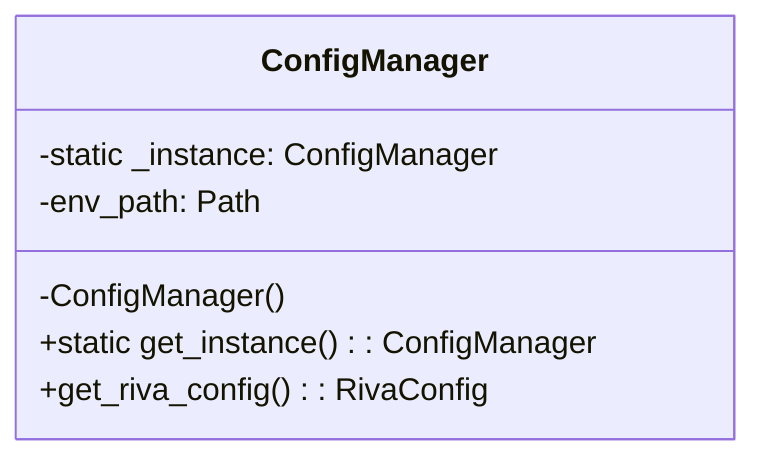
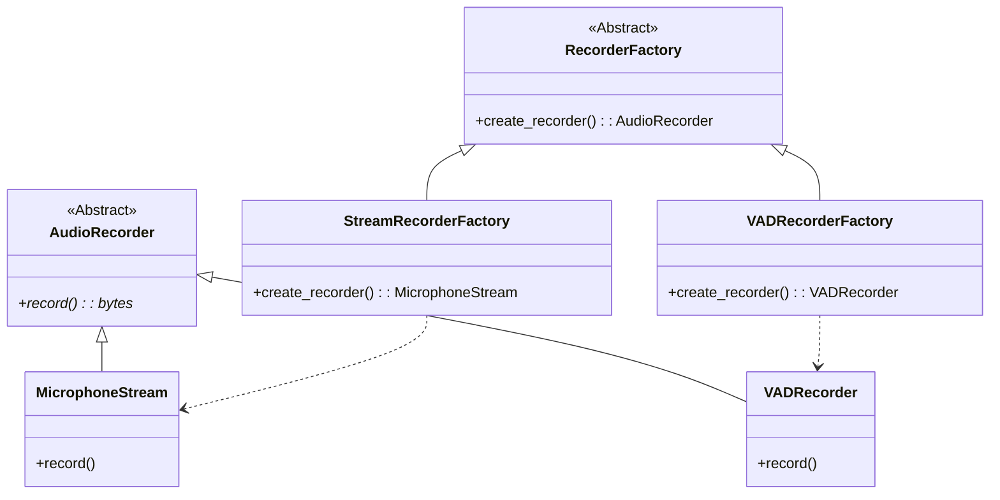
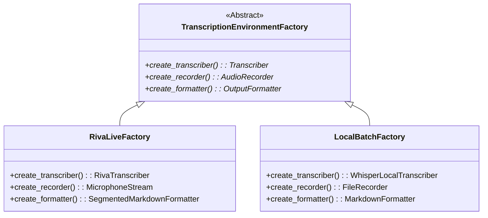

# Análisis y Diseño de Patrones - SpeechNotes

Este documento detalla la implementación de los tres patrones de diseño seleccionados para la arquitectura del proyecto SpeechNotes: **Singleton**, **Factory Method** y **Abstract Factory**.

## 1. Singleton Pattern

### Propósito
Garantizar que una clase tenga una única instancia y proporcionar un punto de acceso global a ella.

### Implementación: `ConfigManager`
Ubicación: `src/core/config.py`

La configuración de la aplicación debe ser consistente y centralizada.

#### Diagrama UML

---

## 2. Factory Method Pattern

### Propósito
Definir una interfaz para crear un objeto, pero dejar que las subclases decidan qué clase instanciar. Permite que una clase delegue la instanciación a subclases.

### Implementación: `AudioRecorderFactory`
Ubicación: `src/audio/factory.py` (Nuevo)

Necesitamos crear diferentes tipos de grabadores (`AudioRecorder`) según el contexto (micrófono continuo, VAD, archivo, stream de prueba), sin acoplar el código cliente a las clases concretas.

#### Diagrama UML

#### Detalles
- **Desacoplamiento**: El cliente (e.g., `TranscriptionService`) pide un grabador a la fábrica y no necesita saber si es VAD o Stream.
- **Extensibilidad**: Para añadir un nuevo grabador (e.g., `NetworkStreamRecorder`), solo creamos una nueva fábrica.

---

## 3. Abstract Factory Pattern

### Propósito
Proporcionar una interfaz para crear familias de objetos relacionados o dependientes sin especificar sus clases concretas.

### Implementación: `TranscriptionEnvironmentFactory`
Ubicación: `src/core/factory.py`

El sistema opera en "entornos" completos que requieren componentes compatibles entre sí. Por ejemplo, un entorno "Riva Live" necesita un transcriptor Riva y un grabador de micrófono. Un entorno "Local Batch" necesita un transcriptor Whisper local y un lector de archivos.

#### Diagrama UML

#### Relación con Factory Method
El **Abstract Factory** puede utilizar internamente **Factory Methods** para crear los productos individuales, o simplemente instanciarlos directamente. En este diseño, `TranscriptionEnvironmentFactory` es la fábrica de alto nivel que orquesta la creación de la familia completa.

---

## Resumen de Cambios

| Patrón | Clase | Responsabilidad |
| :--- | :--- | :--- |
| **Singleton** | `ConfigManager` | Configuración global única. |
| **Factory Method** | `RecorderFactory` | Creación polimórfica de grabadores de audio. |
| **Abstract Factory** | `TranscriptionEnvironmentFactory` | Creación de familias de objetos (Transcriber + Recorder + Formatter). |
