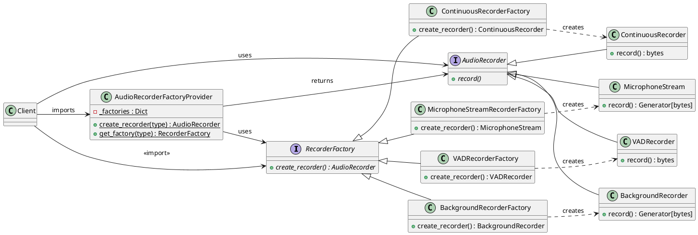

# Diagrama UML - Factory Method Pattern

## Diagrama en PlantUML (Posiciones exactas como tu plantilla)



## Flujo (Izquierda → Derecha)

```
    RecorderFactory ──────────────→ AudioRecorder
           ▲                              ▲
           │ (hereda)                    │ (hereda)
           │                              │
    ┌──────┴──────┬──────────┬──────┐     ┌──────┴──────┬──────────┬──────┐
    │             │          │      │     │             │          │      │
MicroStream   VAD    Continuous  Background   MicroStream   VAD    Continuous  Background
    │             │          │      │     │             │          │      │
    └──────┬──────┴──────────┴──────┘     └──────┬──────┴──────────┴──────┘
           │
    ┌──────▼─────────────────────────────────┐
    │ AudioRecorderFactoryProvider           │
    │  + create_recorder(RecorderType)       │
    │  + get_factory(RecorderType)           │
    └──────▲─────────────────────────────────┘
           │ (imports)
           │
    ┌──────┴─────────────────────────────────┐
    │ Client (realtime.py)                   │
    │ (tu código en src/cli/realtime.py)     │
    └────────────────────────────────────────┘
```

## Mapeo a tu plantilla proporcionada

| Elemento | Tu Plantilla | Nuestro Proyecto |
|---|---|---|
| **AbstractFactory** | Arriba-Izquierda | `RecorderFactory` |
| **ConcreteFactory1/2** | Centro-Izquierda | 4 Factories (Microphone, VAD, Continuous, Background) |
| **AbstractProduct** | Arriba-Derecha | `AudioRecorder` |
| **ProductA1/A2** | Abajo-Derecha | 4 Productos concretos |
| **Provider** | Centro | `AudioRecorderFactoryProvider` |
| **Client** | Derecha | Tu código `realtime.py` |

## Cómo leerlo (como tu plantilla)

1. **Arriba-Izquierda**: `RecorderFactory` - la interfaz madre
2. **Centro-Izquierda**: Las 4 factories heredan de RecorderFactory
3. **Centro**: `AudioRecorderFactoryProvider` - el punto de acceso centralizado
4. **Arriba-Derecha**: `AudioRecorder` - la interfaz de productos
5. **Abajo-Derecha**: Los 4 productos concretos que heredan de AudioRecorder
6. **Derecha**: Client (tu código) importa y usa todo
