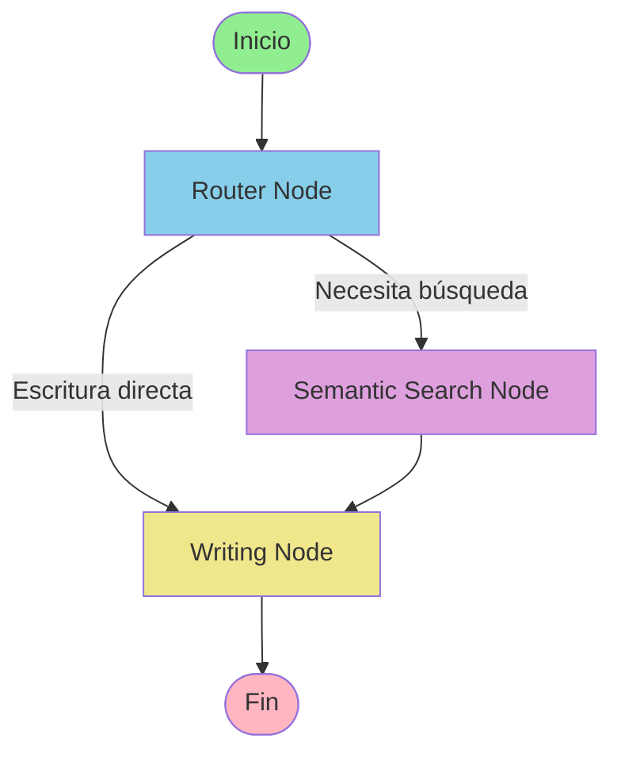

# NVIDIA NIM + LangGraph Agent

Sistema de agente inteligente que combina la API de NVIDIA NIM (DeepSeek-V3.1-Terminus) con LangGraph para crear un agente con capacidades de búsqueda semántica y generación de texto.

## 🏗️ Arquitectura

El sistema está compuesto por tres componentes principales:

### 1. Cliente NVIDIA NIM (`src/llm/nvidia_client.py`)
- **Patrón**: Singleton
- **Funcionalidad**: Wrapper para la API de NVIDIA NIM
- **Características**:
  - Generación de texto síncrona y streaming
  - Soporte para chat con historial de mensajes
  - Configuración flexible de parámetros (temperature, top_p, max_tokens)
  - Manejo de errores robusto

### 2. Vector Store (`src/agent/vector_store.py`)
- **Tecnología**: FAISS + NVIDIA Embedding API
- **Funcionalidad**: Búsqueda semántica de alta calidad
- **Características**:
  - Indexación de documentos con embeddings de NVIDIA
  - Búsqueda por similitud con scores
  - Soporte para metadata
  - API simple para agregar y buscar documentos

### 3. Agente LangGraph (`src/agent/`)
- **Framework**: LangGraph
- **Arquitectura**: Grafo de estados con nodos condicionales
- **Nodos**:
  - **Router**: Analiza la consulta y decide la ruta (búsqueda o escritura directa)
  - **Search**: Realiza búsqueda semántica en la base de conocimientos
  - **Write**: Genera texto usando NVIDIA NIM con o sin contexto

## 📊 Flujo de Trabajo



### Decisión del Router

El router analiza la consulta del usuario para determinar si necesita:

1. **Búsqueda Semántica**: Si la consulta contiene palabras clave como:
   - "buscar", "search", "encontrar", "find"
   - "qué es", "what is", "información sobre"
   - "explica", "explain", "describe"

2. **Escritura Directa**: Para consultas creativas o que no requieren contexto:
   - Generar haikus, poemas, código
   - Respuestas generales sin necesidad de contexto específico

## 🚀 Instalación

### 1. Instalar Dependencias

```bash
cd "c:\Users\gamur\OneDrive - UNIVERSIDAD DE LAS FUERZAS ARMADAS ESPE\ESPE VI NIVEL SII2025\Analisis y Diseño\p"
.venv\Scripts\activate
pip install -r requirements-agent.txt
```

### 2. Configurar Variables de Entorno

Copia `.env.example` a `.env` y configura tus API keys:

```bash
cp .env.example .env
```

Edita `.env` con tus claves:

```env
NVIDIA_API_KEY=tu_clave_de_inferencia
NVIDIA_EMBEDDING_API_KEY=tu_clave_de_embeddings
NVIDIA_BASE_URL=https://integrate.api.nvidia.com/v1
MODEL_NAME=deepseek-ai/deepseek-v3.1-terminus
EMBEDDING_MODEL=nvidia/nv-embedqa-e5-v5
```

## 📖 Uso

### Cliente NVIDIA NIM Básico

```python
from src.llm.nvidia_client import NvidiaInferenceClient

# Crear cliente (Singleton)
client = NvidiaInferenceClient()

# Generación simple
response = client.generate("¿Qué es Python?")
print(response)

# Streaming
for chunk in client.stream_generate("Cuenta hasta 5"):
    print(chunk, end="", flush=True)

# Chat con historial
messages = [
    {"role": "system", "content": "Eres un asistente útil."},
    {"role": "user", "content": "Hola"}
]
response = client.chat(messages)
```

### Vector Store

```python
from src.agent.vector_store import VectorStore

# Crear vector store
vs = VectorStore()

# Agregar documentos
documents = [
    "Python es un lenguaje de programación...",
    "La IA es la simulación de procesos..."
]
metadata = [
    {"topic": "Python"},
    {"topic": "AI"}
]
vs.add_documents(documents, metadata)

# Buscar
results = vs.search("¿Qué es Python?", k=3)
for result in results:
    print(f"Score: {result['score']:.3f}")
    print(f"Doc: {result['document']}")
```

### Agente LangGraph Completo

```python
from src.agent import create_agent_graph, AgentState
from src.agent.nodes import get_vector_store

# Configurar base de conocimientos
vector_store = get_vector_store()
vector_store.add_documents([...])

# Crear agente
app = create_agent_graph()

# Ejecutar consulta
initial_state = {
    "messages": [{"role": "user", "content": "¿Qué es FAISS?"}],
    "query": "¿Qué es FAISS?",
    "search_results": None,
    "generated_text": None,
    "next_action": "",
    "context": None
}

result = app.invoke(initial_state)
print(result["generated_text"])
```

## 🧪 Testing

### Test Cliente NVIDIA NIM

```bash
python scripts/test_nvidia_client.py
```

Ejecuta 4 tests:
1. Generación básica de texto
2. Chat con historial
3. Streaming
4. Parámetros personalizados

### Test Agente LangGraph

```bash
python scripts/test_agent.py
```

Ejecuta 3 tests:
1. Consulta de búsqueda
2. Escritura directa
3. Búsqueda con contexto

### Demo Interactivo

```bash
python scripts/run_agent_demo.py
```

Comandos disponibles:
- `/help` - Mostrar ayuda
- `/docs` - Listar documentos indexados
- `/clear` - Limpiar base de conocimientos
- `/exit` - Salir

## 📁 Estructura del Proyecto

```
p/
├── src/
│   ├── llm/
│   │   ├── __init__.py
│   │   └── nvidia_client.py          # Cliente NVIDIA NIM
│   └── agent/
│       ├── __init__.py
│       ├── state.py                   # Definición de estado
│       ├── vector_store.py            # Búsqueda semántica
│       ├── nodes.py                   # Nodos del agente
│       └── graph.py                   # Grafo LangGraph
├── scripts/
│   ├── test_nvidia_client.py          # Tests del cliente
│   ├── test_agent.py                  # Tests del agente
│   └── run_agent_demo.py              # Demo interactivo
├── .env.example                       # Ejemplo de configuración
└── requirements-agent.txt             # Dependencias
```

## 🔧 Configuración Avanzada

### Parámetros del Modelo

Puedes ajustar los parámetros en `.env`:

```env
TEMPERATURE=0.2      # 0-1, mayor = más creativo
TOP_P=0.7           # 0-1, nucleus sampling
MAX_TOKENS=8192     # Máximo de tokens a generar
```

O al llamar al cliente:

```python
response = client.generate(
    "Tu prompt",
    temperature=0.9,
    top_p=0.95,
    max_tokens=1000
)
```

### Modelos de Embedding

Puedes cambiar el modelo de embeddings en `.env`:

```env
EMBEDDING_MODEL=nvidia/nv-embedqa-e5-v5
```

## 🎯 Casos de Uso

### 1. Sistema de Preguntas y Respuestas

Indexa documentación técnica y permite a los usuarios hacer preguntas:

```python
# Indexar documentación
docs = load_documentation()
vector_store.add_documents(docs)

# Usuario pregunta
result = app.invoke({
    "query": "¿Cómo instalar la librería?",
    ...
})
```

### 2. Asistente de Escritura con Contexto

Genera contenido basado en información específica:

```python
# Indexar ejemplos y guías
examples = load_writing_examples()
vector_store.add_documents(examples)

# Generar contenido similar
result = app.invoke({
    "query": "Escribe un tutorial sobre Python",
    ...
})
```

### 3. Chatbot con Base de Conocimientos

Combina conversación natural con búsqueda de información:

```python
# Base de conocimientos empresarial
kb = load_company_knowledge()
vector_store.add_documents(kb)

# Responder consultas de clientes
result = app.invoke({
    "query": "¿Cuál es la política de devoluciones?",
    ...
})
```

## 🐛 Troubleshooting

### Error: API Key no encontrada

```
ValueError: NVIDIA_API_KEY not found in environment variables
```

**Solución**: Asegúrate de tener el archivo `.env` configurado correctamente.

### Error: FAISS no instalado

```
ImportError: faiss-cpu is required
```

**Solución**: 
```bash
pip install faiss-cpu
```

### Error de conexión a la API

```
RuntimeError: Error generating response from NVIDIA NIM
```

**Solución**: Verifica que:
1. Tu API key sea válida
2. Tengas conexión a internet
3. La URL base sea correcta

## 📚 Referencias

- [NVIDIA NIM API](https://integrate.api.nvidia.com/)
- [LangGraph Documentation](https://langchain-ai.github.io/langgraph/)
- [FAISS](https://github.com/facebookresearch/faiss)
- [OpenAI Python Client](https://github.com/openai/openai-python)

## 🤝 Contribuir

Para agregar nuevas funcionalidades:

1. **Nuevos Nodos**: Agrega funciones en `src/agent/nodes.py`
2. **Modificar Flujo**: Edita `src/agent/graph.py`
3. **Nuevas Fuentes de Datos**: Extiende `VectorStore` en `src/agent/vector_store.py`

## 📝 Licencia

Este proyecto es parte del curso de Análisis y Diseño - ESPE VI NIVEL SII2025.
