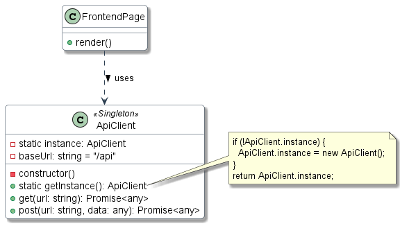
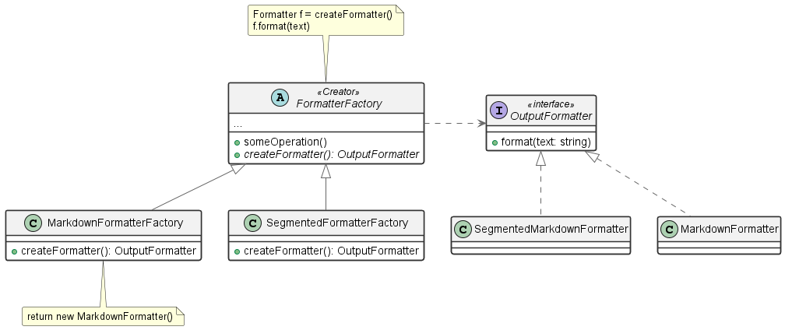
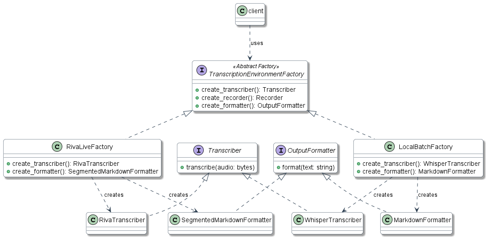
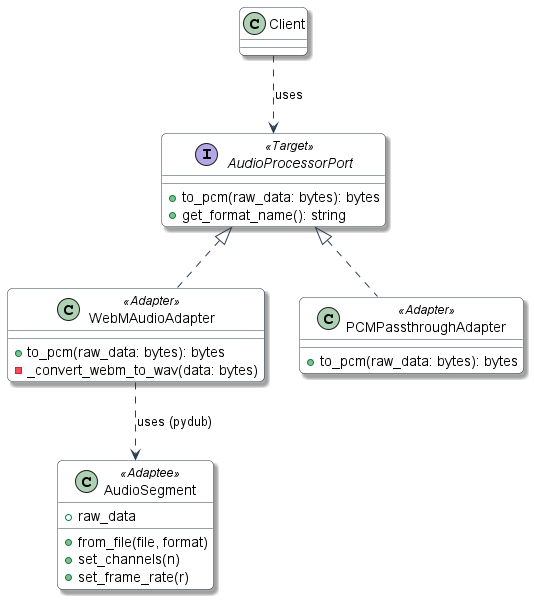
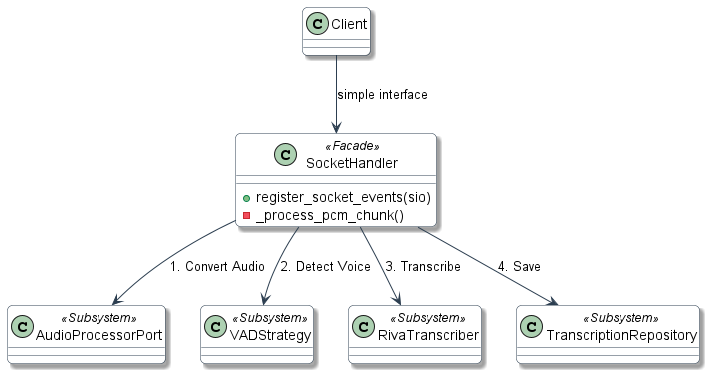
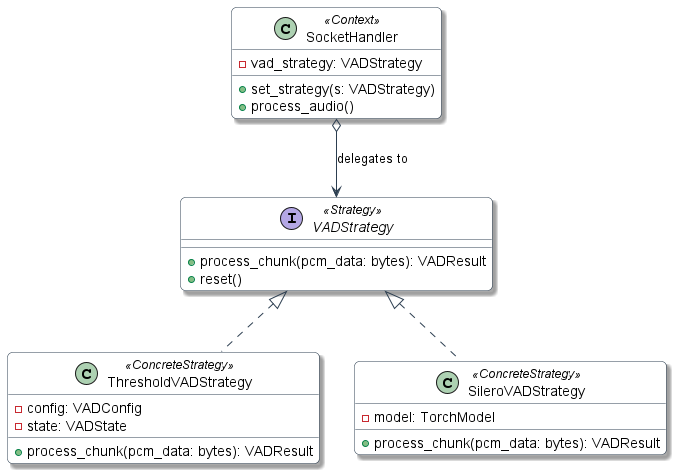
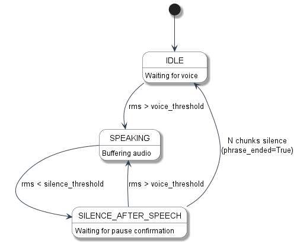
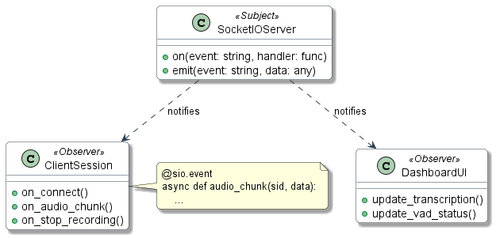

# Patrones de Diseño — SpeechNotes

> Documentación de los patrones de diseño (GoF) identificados e implementados en el proyecto **SpeechNotes**, clasificados en Creacionales, Estructurales y Comportamentales.

---

## 1. Patrones Creacionales

### 1.1 Singleton — `ApiClient`

**Intención:** Garantizar que una clase tenga una única instancia y proporcionar un punto de acceso global a ella.

**Problema que resuelve:** En el frontend, múltiples componentes necesitan realizar llamadas HTTP a la API. Sin un Singleton, cada componente crearía su propia instancia del cliente HTTP, duplicando configuraciones, headers y lógica de reintentos.

**Implementación:**

```typescript
// web/services/ApiClient.ts
export class ApiClient {
  private static instance: ApiClient;
  private baseUrl = '/api';

  private constructor() {}

  public static getInstance(): ApiClient {
    if (!ApiClient.instance) {
      ApiClient.instance = new ApiClient();
    }
    return ApiClient.instance;
  }
}
```

**Diagrama UML:**



**Justificación:**
- Evita instancias duplicadas del cliente HTTP.
- Centraliza la caché en memoria y los headers compartidos.
- Principio **SRP**: la clase solo es responsable de la comunicación con la API.

---

### 1.2 Factory Method — `FormatterFactory`

**Intención:** Definir una interfaz para crear un objeto, pero permitir que las subclases decidan qué clase instanciar.

**Problema que resuelve:** El sistema soporta múltiples formatos de salida (Markdown, Markdown segmentado, texto plano). Sin el Factory Method, el código cliente tendría que conocer e instanciar directamente cada formateador concreto, acoplando la lógica de creación al uso.

**Implementación:**

```python
# src/transcription/formatters.py
class FormatterFactory:
    """Factory Pattern: Centralized creation"""

    _formatters = {
        'markdown': MarkdownFormatter,
        'segmented_markdown': SegmentedMarkdownFormatter,
        'plain': PlainTextFormatter,
    }

    @classmethod
    def create(cls, format_type='markdown'):
        formatter_class = cls._formatters.get(format_type)
        if not formatter_class:
            raise ValueError(f"Unknown: {format_type}")
        return formatter_class()
```

**Diagrama UML:**



**Principios SOLID:**
- **OCP (Open/Closed):** Para agregar un nuevo formato basta con crear la clase e incorporarla al diccionario, sin modificar código existente.
- **DIP (Dependency Inversion):** El código cliente depende de la abstracción `OutputFormatter`, no de las clases concretas.

---

### 1.3 Abstract Factory — `TranscriptionEnvironmentFactory`

**Intención:** Proveer una interfaz para crear familias de objetos relacionados sin especificar sus clases concretas.

**Problema que resuelve:** SpeechNotes opera en dos entornos distintos: **Riva Live** (transcripción en tiempo real por streaming) y **Local Batch** (transcripción local por archivos). Cada entorno necesita un transcriptor, un grabador y un formateador que sean compatibles entre sí. Sin la Abstract Factory, se podrían mezclar componentes incompatibles.

**Implementación:**

```python
# src/core/environment_factory.py
class TranscriptionEnvironmentFactory(ABC):
    @abstractmethod
    def create_transcriber(self):
        pass

    @abstractmethod
    def create_recorder(self, recorder_type, audio_config=None, vad_config=None):
        pass

    @abstractmethod
    def create_formatter(self):
        pass

class RivaLiveFactory(TranscriptionEnvironmentFactory):
    def create_transcriber(self):
        if self._transcriber is None:
            cfg = self.config_manager.get_riva_config()
            self._transcriber = RivaTranscriber(cfg)
        return self._transcriber

    def create_formatter(self):
        return SegmentedMarkdownFormatter()

class LocalBatchFactory(TranscriptionEnvironmentFactory):
    def create_formatter(self):
        return MarkdownFormatter()
```

**Diagrama UML:**



**Justificación:**
- Cada "entorno" (Riva Live, Local Batch) necesita componentes compatibles entre sí.
- La Abstract Factory garantiza que no se mezclen componentes incompatibles.
- Facilita la adición de nuevos entornos sin modificar el código existente.

---

## 2. Patrones Estructurales

### 2.1 Adapter — `AudioProcessorPort`

**Intención:** Convertir la interfaz de una clase en otra interfaz que los clientes esperan. Permite que clases con interfaces incompatibles trabajen juntas.

**Problema que resuelve:** El navegador envía audio en formato WebM/Opus, pero el motor de reconocimiento de voz (NVIDIA Riva) requiere audio en formato PCM 16-bit mono 16kHz. El Adapter normaliza la interfaz de conversión de audio para que el resto del sistema trabaje con una interfaz uniforme.

**Implementación:**

```python
# backend/services/audio_service.py
class AudioProcessorPort(ABC):
    """Adapter Pattern interface"""

    @abstractmethod
    def to_pcm(self, raw_data: bytes) -> bytes:
        """Convert to PCM 16-bit mono 16kHz."""
        ...

    @abstractmethod
    def get_format_name(self) -> str:
        ...

class WebMAudioAdapter(AudioProcessorPort):
    """Adapts WebM/Opus from browser to PCM"""

    def to_pcm(self, raw_data: bytes) -> bytes:
        from pydub import AudioSegment
        audio = AudioSegment.from_file(tmp_path, format="webm")
        audio = audio.set_channels(1)
        audio = audio.set_sample_width(2)
        audio = audio.set_frame_rate(16000)
        return audio.raw_data

class PCMPassthroughAdapter(AudioProcessorPort):
    """Identity adapter: no conversion"""

    def to_pcm(self, raw_data: bytes) -> bytes:
        return raw_data
```

**Diagrama UML:**



**Principios SOLID:**
- **OCP:** Se pueden agregar adaptadores (e.g., WAV, FLAC) sin modificar el código existente.
- **DIP:** `SocketHandler` depende de `AudioProcessorPort`, no de las implementaciones concretas.
- **SRP:** Cada adaptador solo es responsable de una conversión específica.

---

### 2.2 Facade — `register_socket_events` y `ApiClient`

**Intención:** Proporcionar una interfaz unificada a un conjunto de interfaces de un subsistema, haciéndolo más fácil de usar.

**Problema que resuelve:** El procesamiento de audio en tiempo real involucra múltiples subsistemas: conversión de audio (Adapter), detección de voz (VAD Strategy), transcripción (Riva) y persistencia (Repository). Sin la Facade, los clientes tendrían que interactuar con cada subsistema individualmente.

**Implementación (Backend):**

```python
# backend/services/socket_handler.py
def register_socket_events(sio):
    """
    Facade Pattern entry point.
    Delegates to:
      - AudioProcessorPort (Adapter)
      - VADStrategy (Strategy)
      - Riva transcriber
      - TranscriptionRepository
    """
    @sio.event
    async def connect(sid, environ):
        pass  # session initialization

    @sio.event
    async def audio_chunk(sid, data):
        pcm = await asyncio.to_thread(
            _webm_adapter.to_pcm, data
        )
        await _process_pcm_chunk(sio, sid, pcm, session)
```

**Implementación (Frontend):**

```typescript
// web/services/ApiClient.ts
private async request<T>(
  endpoint: string,
  options?: RequestInit,
  retries = 3
): Promise<T> {
  const url = this.baseUrl + endpoint;
  let lastError;
  for (let i = 0; i < retries; i++) {
    const ctrl = new AbortController();
    const tid = setTimeout(() => ctrl.abort(), 15000);
    try {
      const res = await fetch(url, {
        ...options, headers, signal: ctrl.signal,
      });
      clearTimeout(tid);
      return res.json();
    } catch (error: any) {
      clearTimeout(tid);
      lastError = error;
    }
  }
  throw lastError;
}
```

**Diagrama UML:**



**Justificación:**
- Simplifica la interacción del cliente con un subsistema complejo.
- `ApiClient` (frontend) oculta la complejidad de `fetch()`, headers, reintentos, caché y manejo de errores.
- `register_socket_events` (backend) orquesta 4 subsistemas a través de una interfaz simple basada en eventos.

---

## 3. Patrones Comportamentales

### 3.1 Strategy — `VADStrategy`

**Intención:** Definir una familia de algoritmos, encapsular cada uno y hacerlos intercambiables.

**Problema que resuelve:** La detección de actividad de voz (VAD) puede implementarse con diferentes algoritmos: uno basado en umbrales RMS (simple y rápido) u otro basado en modelos de ML como Silero VAD (más preciso). Sin el Strategy, cambiar de algoritmo requeriría modificar directamente el código del `SocketHandler`.

**Implementación:**

```python
# backend/services/vad_service.py
class VADStrategy(ABC):
    """Abstract Strategy for VAD"""

    @abstractmethod
    def process_chunk(self, pcm_data: bytes):
        ...

    @abstractmethod
    def reset(self):
        ...

class ThresholdVADStrategy(VADStrategy):
    """Threshold-based VAD using RMS"""

    def __init__(self, config=None):
        self.config = config or VADConfig()
        self._state = VADState.IDLE
        self._silence_counter = 0

    def process_chunk(self, pcm_data: bytes):
        rms = AudioUtils.calculate_rms(pcm_data)
        should_buffer = False
        phrase_ended = False

        if self._state == VADState.IDLE:
            if rms > self.config.voice_threshold:
                self._state = VADState.SPEAKING
                should_buffer = True

        return VADResult(
            state=self._state, rms=rms,
            should_buffer=should_buffer,
            phrase_ended=phrase_ended
        )
```

**Diagrama UML:**



**Justificación:**
- Permite sustituir el algoritmo de VAD (e.g., por uno basado en ML como Silero VAD) sin modificar el `SocketHandler`.
- Cumple con **OCP** al permitir agregar nuevas estrategias sin alterar el código existente.

---

### 3.2 State — Máquina de Estados VAD

**Intención:** Permitir que un objeto modifique su comportamiento cuando su estado interno cambia.

**Problema que resuelve:** La detección de actividad de voz no es binaria (hablando/silencio). Necesita una transición suave entre estados para evitar cortes prematuros o detecciones falsas. La máquina de estados implementa histéresis con umbrales diferenciados para onset y offset.

**Estados y transiciones:**

| Estado actual | Condición | Estado siguiente |
|---|---|---|
| `IDLE` | RMS > voice_threshold | `SPEAKING` |
| `SPEAKING` | RMS < silence_threshold | `SILENCE_AFTER_SPEECH` |
| `SILENCE_AFTER_SPEECH` | N chunks silenciosos | `IDLE` (phrase_ended) |
| `SILENCE_AFTER_SPEECH` | RMS > voice_threshold | `SPEAKING` |

**Diagrama UML:**



**Justificación:**
- La **histéresis** (umbrales diferentes para onset y offset) previene el *toggling* rápido entre estados.
- El comportamiento del objeto (`ThresholdVADStrategy`) cambia dinámicamente según su estado interno (`VADState`).

---

### 3.3 Observer — Socket.IO Events

**Intención:** Definir una dependencia uno-a-muchos entre objetos, de modo que cuando uno cambie de estado, todos sus dependientes sean notificados.

**Problema que resuelve:** Múltiples clientes pueden estar conectados simultáneamente enviando audio. El servidor necesita reaccionar a diferentes eventos (`connect`, `audio_chunk`, `stop_recording`) de cada cliente de forma desacoplada, sin que los productores de eventos conozcan a los consumidores.

**Implementación:**

```python
# backend/services/socket_handler.py
@sio.event
async def connect(sid, environ):
    """Observer: handles 'connect' event"""
    active_sessions[sid] = {
        "transcription_buffer": [],
        "vad_strategy": ThresholdVADStrategy(vad_cfg),
    }

@sio.event
async def audio_chunk(sid, data):
    """Observer: handles 'audio_chunk'"""
    pcm = await asyncio.to_thread(
        _webm_adapter.to_pcm, data
    )
    await _process_pcm_chunk(sio, sid, pcm, session)

@sio.event
async def stop_recording(sid):
    """Observer: handles 'stop_recording'"""
    asyncio.create_task(
        _handle_stop_recording(sid)
    )
```

**Diagrama UML:**



**Justificación:**
- Socket.IO implementa nativamente el patrón Observer a través de su sistema de eventos.
- Cada handler (`connect`, `audio_chunk`, `stop_recording`) actúa como un observador suscrito a un evento específico.
- Desacopla completamente el emisor del evento de sus manejadores.

---

## Resumen de Patrones

| # | Categoría | Patrón | Clase/Componente | Ubicación |
|---|---|---|---|---|
| 1 | Creacional | **Singleton** | `ApiClient` | `web/services/ApiClient.ts` |
| 2 | Creacional | **Factory Method** | `FormatterFactory` | `src/transcription/formatters.py` |
| 3 | Creacional | **Abstract Factory** | `TranscriptionEnvironmentFactory` | `src/core/environment_factory.py` |
| 4 | Estructural | **Adapter** | `AudioProcessorPort` | `backend/services/audio_service.py` |
| 5 | Estructural | **Facade** | `register_socket_events` / `ApiClient` | `backend/services/socket_handler.py` |
| 6 | Comportamental | **Strategy** | `VADStrategy` | `backend/services/vad_service.py` |
| 7 | Comportamental | **State** | `VADState` (Máquina de Estados) | `backend/services/vad_service.py` |
| 8 | Comportamental | **Observer** | Socket.IO Events | `backend/services/socket_handler.py` |
