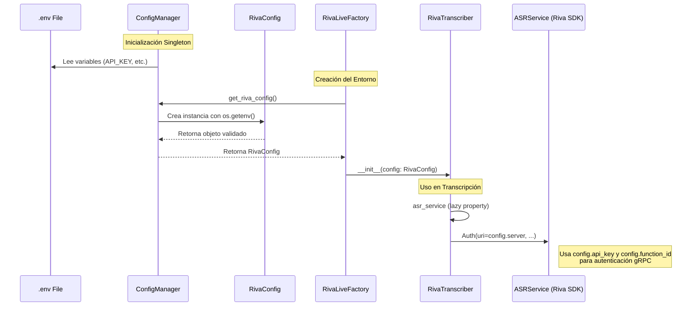

# Análisis Técnico: RivaConfig y get_riva_config

Este documento detalla la implementación, flujo de datos y uso de `RivaConfig` y el método `get_riva_config` dentro del sistema de transcripción.

## 1. Definición de RivaConfig

Ubicación: `src/core/config.py`

`RivaConfig` es un **Data Transfer Object (DTO)** implementado como una `dataclass` inmutable que encapsula la configuración necesaria para conectar con el servidor NVIDIA Riva.

```python
@dataclass
class RivaConfig:
    """Configuration for NVIDIA Riva connection"""
    api_key: str
    server: str
    function_id: str
    
    def __post_init__(self):
        if not self.api_key:
            raise ValueError("API_KEY is required")
        if not self.function_id:
            raise ValueError("RIVA_FUNCTION_ID_WHISPER is required")
```

### Características Clave:
*   **Validación Automática**: Utiliza `__post_init__` para asegurar que `api_key` y `function_id` no estén vacíos al momento de la creación.
*   **Inmutabilidad**: Al ser una dataclass (y conceptualmente usada como configuración), garantiza que los parámetros de conexión no cambien inesperadamente.

## 2. Implementación de get_riva_config

Ubicación: `src/core/config.py` (Clase `ConfigManager`)

El método `get_riva_config` es el responsable de **construir** la instancia de `RivaConfig` extrayendo valores de las variables de entorno cargadas por el `ConfigManager`.

```python
def get_riva_config(self) -> RivaConfig:
    """
    Get validated Riva configuration
    """
    return RivaConfig(
        api_key=os.getenv("API_KEY", ""),
        server=os.getenv("RIVA_SERVER", "grpc.nvcf.nvidia.com:443"),
        function_id=os.getenv("RIVA_FUNCTION_ID_WHISPER", "")
    )
```

### Mapeo de Variables de Entorno:
| Propiedad RivaConfig | Variable de Entorno | Valor por Defecto |
|----------------------|---------------------|-------------------|
| `api_key` | `API_KEY` | `""` (Lanza error si falta) |
| `server` | `RIVA_SERVER` | `"grpc.nvcf.nvidia.com:443"` |
| `function_id` | `RIVA_FUNCTION_ID_WHISPER` | `""` (Lanza error si falta) |

## 3. Flujo de Uso (Data Flow)

El siguiente diagrama muestra cómo fluye la configuración desde el archivo `.env` hasta el servicio de transcripción.



## 4. Integración en RivaTranscriber

Ubicación: `src/core/riva_client.py`

La clase `RivaTranscriber` recibe `RivaConfig` en su constructor (Inyección de Dependencias), desacoplando la lógica de transcripción de la lógica de configuración.

```python
class RivaTranscriber:
    def __init__(self, config: RivaConfig):
        self.config = config
        self._asr_service = None

    @property
    def asr_service(self) -> ASRService:
        if self._asr_service is None:
            auth = Auth(
                uri=self.config.server,      # Usa config.server
                use_ssl=True,
                metadata_args=[
                    ["function-id", self.config.function_id], # Usa config.function_id
                    ["authorization", f"Bearer {self.config.api_key}"] # Usa config.api_key
                ]
            )
            self._asr_service = ASRService(auth)
        return self._asr_service
```

## 5. Conclusión

La implementación sigue principios sólidos de diseño:
1.  **Single Responsibility Principle (SRP)**: `RivaConfig` solo almacena datos, `ConfigManager` gestiona la carga, y `RivaTranscriber` usa la configuración.
2.  **Fail Fast**: La validación en `__post_init__` asegura que la aplicación falle inmediatamente si falta configuración crítica, evitando errores oscuros de conexión más adelante.
3.  **Seguridad**: Las credenciales sensibles (`api_key`) se manejan a través de variables de entorno y se pasan encapsuladas, no hardcodeadas.
