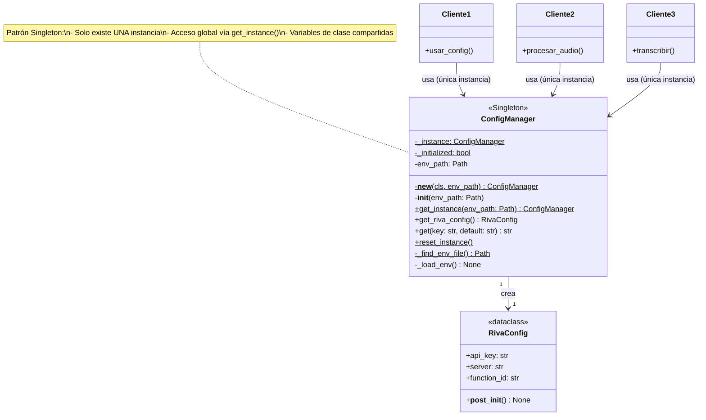
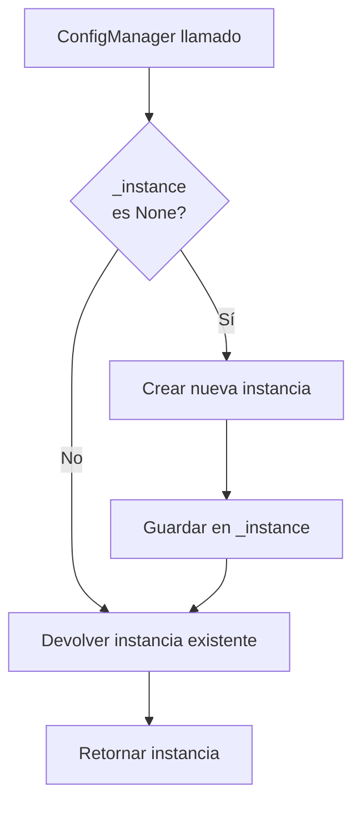

# Diagrama UML y Documentación Detallada - Singleton Pattern en ConfigManager

## 📐 Diagrama UML de Clases Completo



---

## 🎯 ¿Para Qué Sirve el Singleton en ConfigManager?

El patrón **Singleton** garantiza que `ConfigManager` tenga **una única instancia** en toda la aplicación, proporcionando:

### ✅ **Configuración Consistente**
- Todos los módulos ven la misma configuración
- No hay riesgo de inconsistencias

### ✅ **Eficiencia de Recursos**
- El archivo `.env` se lee **solo una vez**
- Una sola instancia en memoria (no duplicación)

### ✅ **Acceso Global Controlado**
- Disponible desde cualquier módulo via `get_instance()`
- No necesitas pasar `config` como parámetro por todos lados

---

## 🔍 Componentes del Singleton

### 1. Variables de Clase Compartidas

```python
_instance: Optional['ConfigManager'] = None  # Almacena la única instancia
_initialized: bool = False                   # Evita reinicializaciones
```

### 2. Método `__new__` (Control de Creación)

```python
def __new__(cls, env_path=None):
    if cls._instance is None:
        cls._instance = super().__new__(cls)
    return cls._instance  # Siempre devuelve la misma
```

**Flujo:**


### 3. Constructor `__init__` Protegido

```python
def __init__(self, env_path=None):
    if self._initialized:
        return  # ⛔ No reinicializar
    
    self.env_path = env_path or self._find_env_file()
    self._load_env()
    self._initialized = True
```

### 4. Método `get_instance()` (Acceso Global)

```python
@classmethod
def get_instance(cls, env_path=None):
    if cls._instance is None:
        cls._instance = cls(env_path)
    return cls._instance
```

---

## 📊 Ejemplo de Uso

```python
# Primera llamada: crea instancia y lee .env
config1 = ConfigManager.get_instance()

# Segunda llamada: devuelve LA MISMA instancia
config2 = ConfigManager.get_instance()

# Tercera llamada: constructor directo también funciona
config3 = ConfigManager()

# Verificar que son la misma instancia
assert config1 is config2 is config3  # ✅ True
print(f"ID único: {id(config1)}")
```

---

## 🧪 Prueba del Singleton

Ejecutar `test_singleton.py`:

```bash
python test_singleton.py
```

**Resultado esperado:**
```
✅ ÉXITO: Las tres variables apuntan a la MISMA instancia
   Todas tienen el mismo ID: 1855539823296
✅ Ambas instancias devuelven la misma configuración
✅ PATRÓN SINGLETON IMPLEMENTADO CORRECTAMENTE
```

---

## 💡 Ventajas vs Sin Singleton

| Aspecto | Sin Singleton | Con Singleton |
|---------|---------------|---------------|
| **Instancias** | Múltiples | Una única |
| **Lectura .env** | Cada vez | Solo una vez |
| **Memoria** | N instancias | 1 instancia |
| **Consistencia** | Puede variar | Siempre igual |

---

## 🎓 Conceptos Clave

### Variable de Clase vs Instancia

```python
class Ejemplo:
    var_clase = 0           # Compartida por todas
    
    def __init__(self):
        self.var_instancia = 0  # Individual por instancia
```

### `__new__` vs `__init__`

- **`__new__`**: Crea el objeto (se ejecuta primero)
- **`__init__`**: Inicializa el objeto (se ejecuta después)

---

## 📝 Resumen

El **Singleton** en `ConfigManager`:

1. ✅ Garantiza **una única instancia**
2. ✅ Lee `.env` **solo una vez**
3. ✅ **Configuración consistente** en toda la app
4. ✅ **Acceso global** via `get_instance()`
5. ✅ **Eficiente** en recursos

**Ideal para configuración** porque debe ser única, global y consistente.
