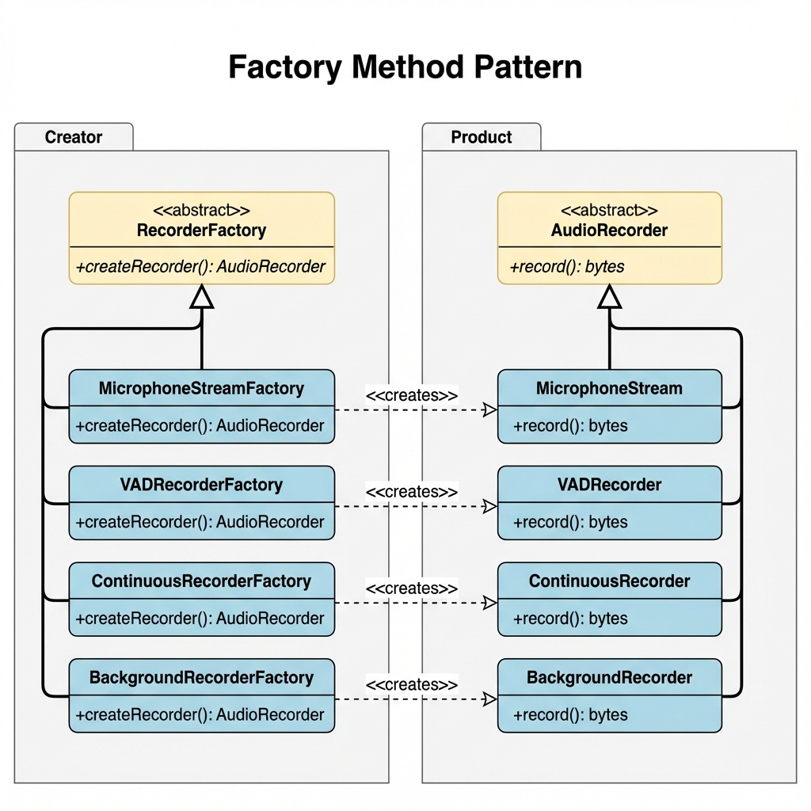

# 📁 Factory Method Pattern - Documentación Completa

Esta carpeta contiene la documentación completa del **Factory Method Pattern** implementado en SpeechNotes.

---

## 📄 Archivos en esta Carpeta

### 1. 📖 [README.md](README.md)
**Documentación principal del patrón**

Contiene:
- Resumen del patrón
- Ubicación de la implementación
- Estructura del patrón
- Diagrama UML
- Código de implementación
- Ejemplos de uso
- Ventajas y principios SOLID
- Guía de extensibilidad
- Referencias

**Ideal para**: Entender qué es el patrón y cómo usarlo.

---

### 2. 🔍 [ANALISIS.md](ANALISIS.md)
**Análisis técnico profundo**

Contiene:
- Identificación del patrón en el código
- Arquitectura detallada
- Flujo de creación (diagramas de secuencia)
- Puntos de uso en el proyecto
- Beneficios obtenidos
- Aplicación de principios SOLID
- Comparación con Abstract Factory
- Validación y tests
- Métricas de impacto
- Conclusiones

**Ideal para**: Análisis académico y técnico detallado.

---

### 3. 🖼️ [factory_method_uml.png](factory_method_uml.png)
**Diagrama UML del patrón**

Muestra:
- Jerarquía de Creators (RecorderFactory)
- Jerarquía de Products (AudioRecorder)
- Relaciones de herencia
- Relaciones de dependencia (creates)
- Notación UML profesional

**Ideal para**: Visualizar la estructura del patrón.

---

## 🎯 Resumen Rápido

### ¿Qué es?
El **Factory Method Pattern** permite crear diferentes tipos de grabadores de audio sin acoplar el código cliente a las clases concretas.

### ¿Dónde está?
**`src/audio/factory.py`**

### ¿Cómo se usa?
```python
from src.audio import RecorderType, AudioRecorderFactoryProvider

recorder = AudioRecorderFactoryProvider.create_recorder(
    RecorderType.VAD,
    config=audio_config,
    vad_config=vad_config
)
```

### Tipos Disponibles
- `RecorderType.MICROPHONE_STREAM` → `MicrophoneStream`
- `RecorderType.VAD` → `VADRecorder`
- `RecorderType.CONTINUOUS` → `ContinuousRecorder`
- `RecorderType.BACKGROUND` → `BackgroundRecorder`

---

## 📊 Diagrama UML



---

## 🔗 Enlaces Rápidos

### Código Fuente
- [src/audio/factory.py](../src/audio/factory.py) - Implementación del patrón
- [src/audio/capture.py](../src/audio/capture.py) - Productos (AudioRecorder)
- [src/cli/realtime.py](../src/cli/realtime.py) - Uso del patrón (3 puntos)

### Tests y Ejemplos
- [test_factory_method.py](../test_factory_method.py) - Tests completos (7/7 ✅)
- [examples_factory_method.py](../examples_factory_method.py) - 6 ejemplos ejecutables

### Documentación General
- [docs/design_patterns.md](../docs/design_patterns.md) - Patrones del proyecto

---

## 🧪 Ejecutar Tests

```bash
# Desde la raíz del proyecto
python test_factory_method.py
```

**Resultado esperado**: ✅ ALL TESTS PASSED (7/7)

---

## 💻 Ver Ejemplos

```bash
# Desde la raíz del proyecto
python examples_factory_method.py
```

**Muestra**: 6 ejemplos prácticos de uso del patrón

---

## ✅ Estado de Implementación

✅ Pattern implementado  
✅ Tests pasando (7/7)  
✅ Ejemplos funcionales  
✅ Documentación completa  
✅ SOLID principles aplicados  
✅ En uso en producción  

---

## 📚 Para Más Información

1. **Uso básico** → Lee [README.md](README.md)
2. **Análisis técnico** → Lee [ANALISIS.md](ANALISIS.md)
3. **Diagrama visual** → Ve [factory_method_uml.png](factory_method_uml.png)
4. **Código fuente** → Explora `src/audio/factory.py`
5. **Ejemplos prácticos** → Ejecuta `examples_factory_method.py`

---

## 🎓 Conceptos Clave

> **Factory Method Pattern**: Define una interfaz para crear objetos, pero deja que las subclases decidan qué clase instanciar.

**Beneficio principal**: Desacopla el código cliente de las clases concretas, facilitando la extensión y el mantenimiento.

---

**Creado para**: Proyecto SpeechNotes - Análisis y Diseño de Software  
**Fecha**: Noviembre 2025
